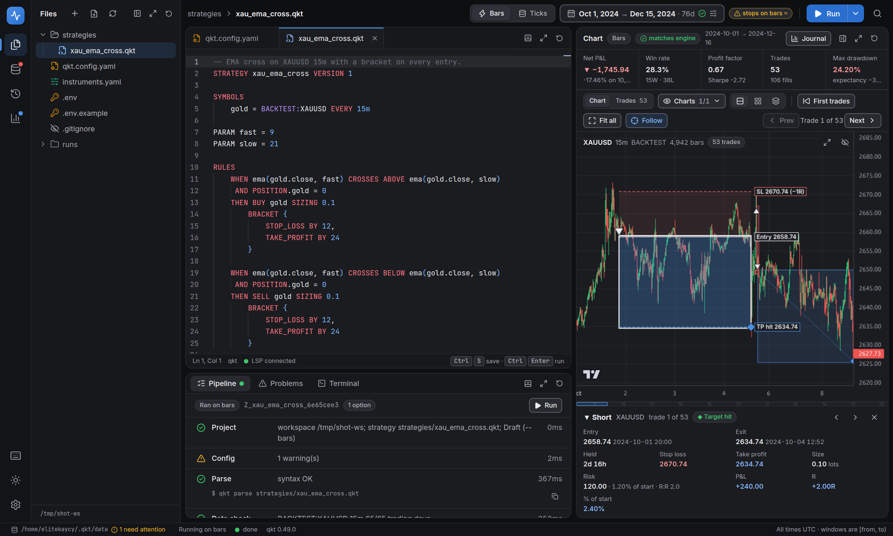
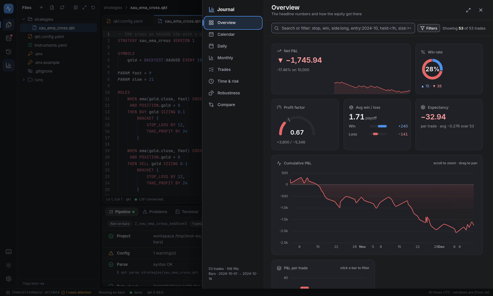
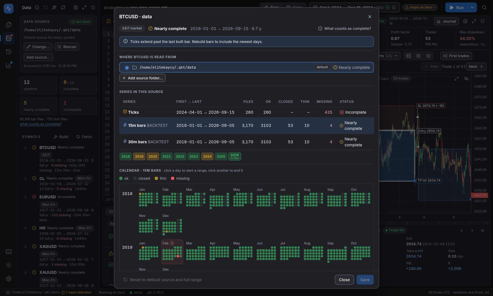

<h1 align="center">qkt backtester</h1>

<h3 align="center">A browser workspace for <a href="https://github.com/elitekaycy/qkt">qkt</a>.<br/>Write a strategy, run it, and follow every trade on the chart, all from one container.</h3>

<p align="center">
  <a href="https://github.com/elitekaycy/qkt-backtester/actions/workflows/check.yml"></a>
  <a href="LICENSE"></a>
  
  
</p>

<p align="center">
  
</p>

---

**qkt backtester** wraps the [qkt](https://github.com/elitekaycy/qkt) CLI in a workspace you use from the browser: an editor with live diagnostics from `qkt lsp`, a one-click run, a chart that walks you through each entry and exit, and a trading-journal view of the results. **Plain files are the only source of truth**, it never modifies qkt, and it only uses qkt's CLI, `qkt lsp` and the files qkt writes.

## Features

- **Editor with qkt's own diagnostics.** Syntax highlighting from qkt's TextMate grammar, errors as you type, optional vim keybindings, undo/redo, auto-save. `qkt.config.yaml`, `instruments.yaml` and `.env` are edited in the same place.
- **Run from a button.** The window, data tier (bars or ticks) and options become a `qkt backtest` command that runs in the background. The Pipeline tab shows every step with its timing and the exact command. **Stop** kills the run and removes its partial output.
- **A chart you can explain.** Green and red candles, one chart per timeframe, and a small box for each trade from entry to exit. Click a trade for its entry, exit, stop, target, size, risk, P&L and hold time, and step through trades one by one with the arrow keys.
- **A trading journal.** Overview, calendar, daily and monthly P&L, trades with analysis, time and risk breakdowns, Monte Carlo, parameter grids and walk-forward. Search-driven filters with suggestions (`symbol:XAUUSD`, `side:long`, `entry:2024-10`, `exited:>=2024-10-15`, `held:<1h`, `pnl:>50`, `size:>=1`, `exit:stop`, `#12`) work in the Journal and in the chart's Trades tab and drive every chart; the charts hover, zoom and drill down.
- **Data you can trust.** The data source is scanned per symbol, timeframe and year and every day is classified: ok, closed (weekends, holidays, empty files), thin or missing. It knows crypto trades on weekends and FX does not, so a holiday is not reported as a hole. Each symbol can use its own source folder and date range.
- **Everything is configurable, in files.** Contract size, lot step, commission and swap in `instruments.yaml`; account, execution and risk in `qkt.config.yaml`; secrets in `.env`, read by `${VAR}` in the config.
- **Panels that adapt.** Every pane collapses, maximizes and resets; light and dark themes; a command palette (`Ctrl+K`) for everything.
- **Tools for Claude Code.** The studio serves MCP tools at `/api/mcp`: try a change on a copy and see it on the chart, propose edits, set the train/test split. See [docs/production.md](docs/production.md#5-the-studios-tools-mcp).

<p align="center">
  
  
</p>
<p align="center"><sub>Journal overview · a symbol's data calendar · <a href="docs/assets/workbench-light.png">light theme</a> · <a href="docs/assets/journal-daily.png">daily P&L</a></sub></p>

## Quick start

You need [qkt](https://github.com/elitekaycy/qkt) data on disk (ticks and/or bars in a qkt data store) and Docker.

```bash
git clone https://github.com/elitekaycy/qkt-backtester && cd qkt-backtester
mkdir workspace                     # your strategies live here (owned by you, so files stay yours)
docker compose up --build           # http://localhost:8080
```

or without compose:

```bash
docker build -f docker/Dockerfile -t qkt-backtester .
docker run --rm -p 127.0.0.1:8080:8080 \
  -v "$PWD/workspace:/workspace" -v "$HOME/.qkt/data:/data" qkt-backtester
```

- **First run needs nothing.** An empty `/workspace` is seeded with a full `qkt.config.yaml`, an `instruments.yaml` with an entry for every symbol in your data source, a `.env`, and sample strategies on a symbol that exists. An *empty* `/data` gets a small **synthetic** dataset (`DEMOUSD`, a seeded random walk, clearly not market data) built by qkt itself. A data store that already has files is never touched.
- **Your data:** mount your qkt data store at `/data` (default `~/.qkt/data`). It is read for candles and ticks; "Build bars" writes into it, so mount it read-only only if it is already complete.
- **Files stay yours.** The container drops to the owner of the mounted `/workspace`. If Docker created the folder as root you'll get a note; create it yourself first (`mkdir workspace`).
- **Exposing it beyond localhost:** set `STUDIO_TOKEN=<secret>`. That requires a token for the API and enables the full-shell terminal (add `STUDIO_TERMINAL=restricted` to keep it to `qkt` commands). Without a token on a non-loopback bind the terminal is restricted to `qkt` commands plus a few file helpers (`ls`, `cd`, `cat`, `tree`, …). There are no user accounts; this is a single-user or small-team tool, one container per workspace.
- **Engine version:** the qkt engine is pinned by digest in `docker/Dockerfile`; build another with `--build-arg QKT_IMAGE=ghcr.io/elitekaycy/qkt:<tag>`.
- **Released images and servers:** tagged versions are published as `ghcr.io/elitekaycy/qkt-backtester:vX.Y.Z`. [docs/production.md](docs/production.md) covers releasing, running on a server (read-only data, token, private access), settings and upgrades.

## Using it

1. **Set the data source** (rail → Data). Every symbol is marked complete, nearly complete or incomplete, with the longest complete window and which strategies can run on bars or ticks. Change the folder, build bars from ticks or fetch more from that section. Nothing is fetched automatically.
2. **Write** a `.qkt` file. Turn on **Vim keybindings** in Preferences (bottom of the rail) if you want them.
3. **Run** with the **Run** button or `Ctrl+Enter`. **Stop** (or `Ctrl+.`) kills the run.
4. **Study** it: the Chart shows candles and trade boxes beside the code; **Journal** (`Ctrl+J`) is the full analysis.
5. **Stress** it: Monte Carlo, parameter grid and walk-forward live under Journal → Robustness.

## Project files

All editable in the Files panel.

| File | What it controls |
|---|---|
| `qkt.config.yaml` | Account (starting balance, currency), execution model, risk halts (note `risk.max_daily_loss` defaults to 1000 and applies to backtests), plus the live sections, commented. A new workspace gets the **full** reference config; active lines equal qkt's defaults. |
| `instruments.yaml` | Contract size, lot step/min/max, digits, commission per lot, slippage points, swap, per symbol. Passed to every run (`--instruments`). qkt only knows FX majors, gold and silver on its own, so any other symbol (BTC, oil, copper…) **needs an entry**; a new workspace gets one for every symbol in your data source. |
| `.env` | Variables for `${NAME}` / `${NAME:-default}` in `qkt.config.yaml`, also visible to every qkt command and the terminal. Editing it changes a run's identity, so it re-runs instead of hitting the cache. Git-ignored; `.env.example` is the template. |

`qkt backtest` ignores `starting_balance` in the config on its own; the studio passes it as `--starting-balance` so the number in the file is the number used. Files → *Add missing project files* creates whichever of these an older workspace lacks (never overwriting).

### What "complete data" means

The Data section classifies every calendar day of a series: **ok** (market open, data present), **closed** (empty file; weekend for a Mon–Fri market; Dec 25 / Jan 1; a weekday most symbols lack; US exchange holidays a series demonstrably follows), **thin** (open but under half a normal day's bars: usable, flagged) and **missing** (a real gap). A window is *complete* when it has no missing day; *nearly complete* is ≤ 2% missing. 24/7 markets (crypto: they trade Saturdays) treat weekends and empty days as gaps; a year in which such a feed followed a weekday schedule is judged on its own. A data source that starts or ends mid-year is not "incomplete": partial years are labelled as such. Click a symbol for its calendar, gaps, sources and window. Each symbol can use its own source folder and start/end (default: the default source, first to last day found); *Reset all* restores the defaults and *Auto-find* picks the best source per symbol. qkt itself additionally checks every session hour when a tick run starts (the Coverage step).

## Bars vs ticks (Draft vs Full)

Runs default to **bars** (fast). Switch to **ticks** with the Bars/Ticks control in the top bar, or under *Run settings → Run on*.
Tick-only options (broker model, execution preset, slippage) are disabled in bars mode with an explanation.

| | qkt flags | Speed (measured) | Use |
|---|---|---|---|
| **Draft** | `--bars` | ~1 s per month, ~2.5 s per year | iterate |
| **Full** | tick replay | 13–31 s per month (+ a silent ~7 s coverage check) | verify |

With market orders they gave **identical** trades, P&L and drawdown. With **stops, targets or brackets they differ**:
on the bundled bracket demo Draft −106.88 vs Full −95.95. The studio warns in the run bar and pipeline when a Draft run uses
intrabar orders, and the tier is stamped on every run, chart and metric. Use **Verify with Full** before trusting a number.

## Data and calendars

- Windows are `[from, to)`. qkt's `--to` is **exclusive**, and so is everything here. All times are UTC.
- The studio never auto-fetches (`--no-fetch`). Missing data stops the run at **Data check** with qkt's own remedy:
  **Build bars** (from your tick store), or **Run anyway** (waive the holes; they stay recorded on the run).
- qkt's calendar is **not holiday-aware**: days like US holidays and Good Friday are flagged incomplete even though the
  market was thin or shut. The waive flow exists for that. Each chart has a coverage strip: closed (hatched), thin (amber),
  missing (red).
- The bar store ignores the config's `data_root`; the studio always sets `QKT_DATA_HOME`, and warns if they differ.

## What is on disk

```
/workspace
  qkt.config.yaml            yours
  strategies/*.qkt           yours
  .qkt-studio/               derived, deletable: run index (SQLite), job records
  runs/<YYYYMMDDTHHMMSSZ>_<strategy>_<hash8>/
    run.json                 status, steps, params, engine version, waived days, timings
    source/                  strategy + config snapshot (secrets redacted)
    engine/                  qkt's own bundle, untouched: result.json, trades.csv, equity_*.csv, manifest.json, report.html
    derived/                 round trips, summary, monthly, equity, integrity, meta
    robustness/              Monte Carlo results (seed included)
    logs/                    stdout.log, stderr.log, events.ndjson
```

The run id ends in a hash of the strategy, config, params, window, tier, engine version and the data files it reads.
Re-running identical inputs is an instant cache hit; changing any of them (including fetching new data) is a new run.
A "trade" is a **round trip**; qkt's own `tradeCount` counts *fills*, and both are shown. Round trips are reconciled to
the engine's realised P&L on every run.

## Integrity checks (every run)

| Check | Meaning |
|---|---|
| Trades reconcile with engine P&L | Σ round-trip P&L equals qkt's `realizedTotal` |
| Chart bars match engine candles | the bars drawn are the bars qkt evaluated (exact count for the window) |
| Every fill lies inside its bar | catches misplaced data; amber (expected) in Draft for stop/target fills |
| Engine artifact checksums | every file in qkt's `manifest.json` still matches its sha256 |

## Portfolios

A `PORTFOLIO` file (qkt's own `IMPORT '...' AS alias` / `RUN alias` syntax) runs several strategies as one book. The
studio treats a portfolio run exactly like a single-strategy one — same trades.csv, same charts, same journal — with
a bit more shown when there is more than one strategy to show:

- **Files** — a portfolio file expands to list its members (alias, path, `HOLD`, a warning if one is missing); a
  strategy used by more than one portfolio is marked. "New portfolio" scaffolds `IMPORT`/`RUN` lines for the
  strategies you pick.
- **Chart** — every strategy that trades a symbol draws on that symbol's chart, each in its own colour and badge, with
  a legend to show, hide or solo a strategy (double-click). The trade detail card and the trades list name the
  strategy a trade belongs to.
- **Journal → Strategies** — appears only for a portfolio run: per-strategy P&L, win rate, profit factor and
  contribution to the book, an equity chart per strategy against the book total, and the book's own risk numbers
  (gross/net exposure, volatility, return correlation between strategies) when qkt reports them.
- **Search** — `strategy:trend` (or the alias alone) filters trades to one strategy, everywhere filters apply.

A single-strategy run shows none of this: no extra columns, no legend, no Strategies section.

## Known limits

- Single-user / small-team. No accounts. One qkt version per image.
- The LSP and `qkt parse` report **one error at a time**; unknown indicators are reported by qkt at `1:1` and relocated
  by the studio. An unknown stream alias is silently accepted by qkt (it just never trades), so the studio blocks it.
- Terminal resize is not propagated to the shell (a pty without a native module). Sweeps use one run per grid point (max 200).
- Tables page from memory up to 2,000,000 fills; beyond that the run is refused with a clear message.
- `qkt fetch` needs network and broker access and was not exercised offline. Docker Desktop file-watching is not used at
  all: edits go through the API and an on-disk change is detected by a save conflict, not live.
- Not verified: non-XAUUSD calendars, Windows hosts.

## Develop

```bash
pnpm install
pnpm -r build && pnpm -r test                 # core, server (uses the real qkt binary + your ~/.qkt/data when present) and web
QKT_BIN=qkt WORKSPACE=./workspace QKT_DATA_HOME=~/.qkt/data pnpm --filter @qkt-studio/server dev
pnpm --filter @qkt-studio/web dev             # http://localhost:5173, proxies /api and /ws to :8080
node scripts/e2e.mjs                          # browser e2e (system Chrome) against a running studio on :8099
```

`packages/core` is pure and fixture-tested against real qkt output (`test/fixtures`); `packages/server` is a Fastify app that runs qkt in its own process groups; `packages/web` is React + Monaco + Lightweight Charts + ECharts. Design, probe evidence and the edge-case register: [`docs/specs/2026-09-25-qkt-backtester-design.md`](docs/specs/2026-09-25-qkt-backtester-design.md). See [CONTRIBUTING.md](CONTRIBUTING.md).

## License

[Apache 2.0](LICENSE). Backtests are not advice: the chart and numbers show what a strategy would have done on the data you gave it.
