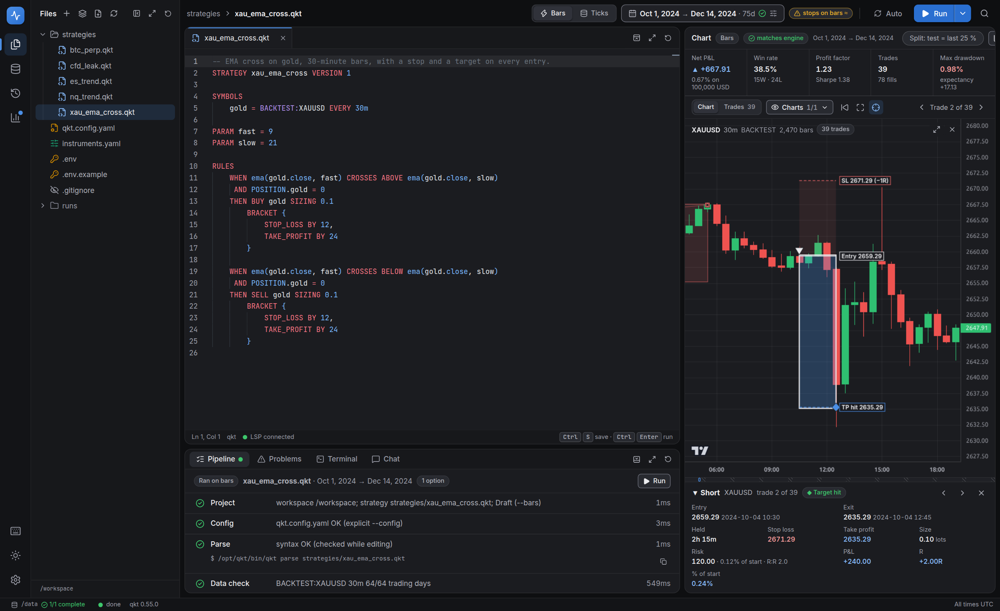
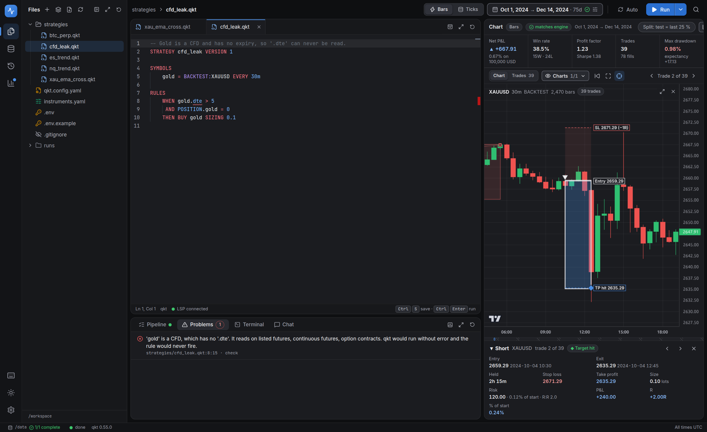
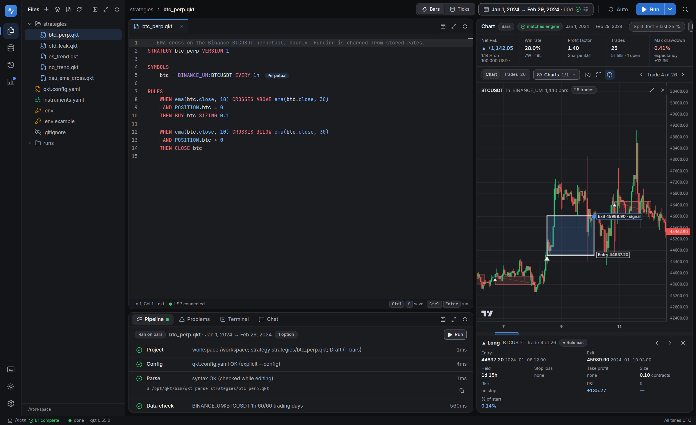
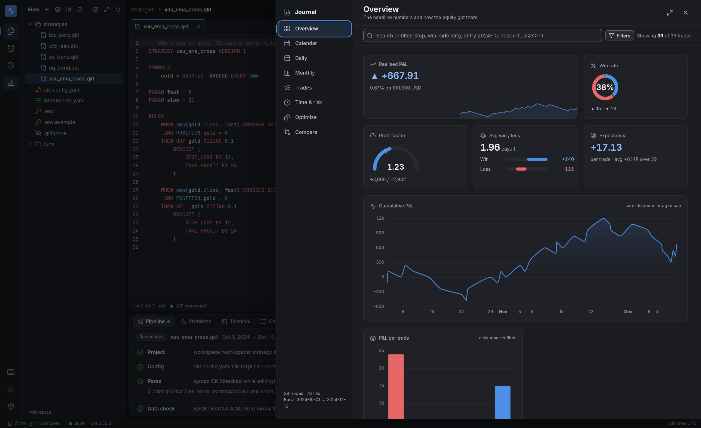
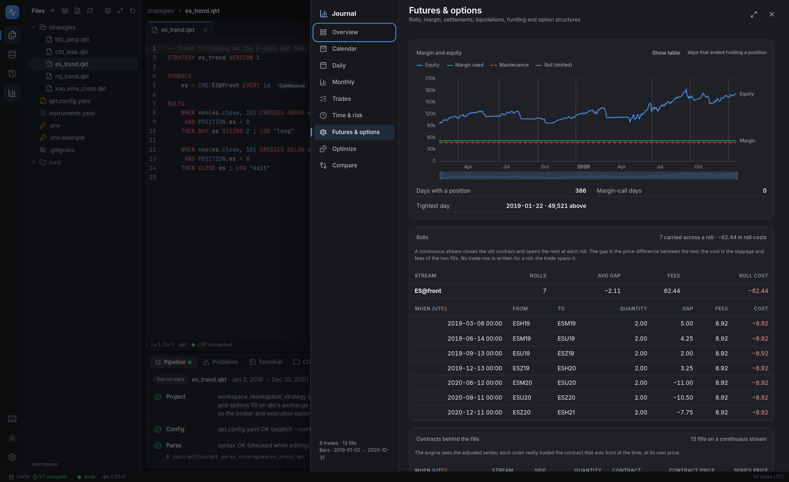
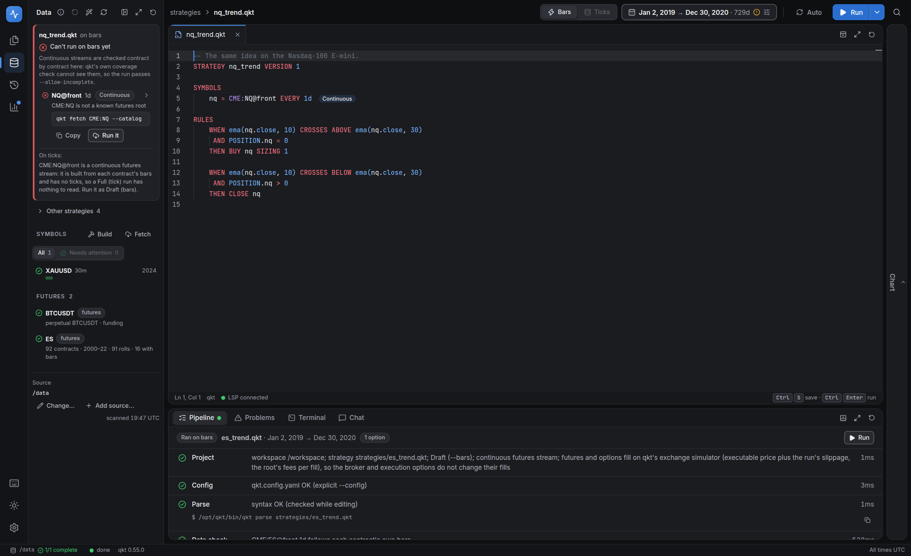

<div align="center">

<br>

# qkt backtester

**Write a strategy. Run it. Follow every trade.**

A browser workspace for [qkt](https://github.com/elitekaycy/qkt): CFDs, futures and options,<br>
one editor, one chart, one journal, in a single container.

<br>

[**Get started**](#get-started) &nbsp;·&nbsp; [Futures &amp; options](docs/futures-and-options.md) &nbsp;·&nbsp; [Deploy](docs/production.md) &nbsp;·&nbsp; [Design](docs/specs/2026-09-25-qkt-backtester-design.md)

<br>

<picture>
  <source media="(prefers-color-scheme: light)" srcset="docs/assets/hero-light.png">
  
</picture>

<br>
<br>

</div>

## Get started

```bash
git clone https://github.com/elitekaycy/qkt-backtester && cd qkt-backtester
mkdir workspace && docker compose up --build
```

Open **http://localhost:8080**. An empty workspace is seeded with a config, instrument terms and sample strategies, and an
empty data folder gets a small synthetic dataset, so the first run works with nothing else installed. Point it at your own
qkt data store when you are ready ([how](#your-data)).

<br>

## Write

<picture>
  <source media="(prefers-color-scheme: light)" srcset="docs/assets/write-light.png">
  
</picture>

The editor speaks qkt's own language: highlighting, completions and diagnostics come from the qkt you run, so they are never
out of date. It also knows what each stream *is*. Reading `.dte` on a CFD, which qkt would accept and then never trade on, is
an error here, and completions after `alias.` list only the fields that instrument has.

<br>

## Run

<picture>
  <source media="(prefers-color-scheme: light)" srcset="docs/assets/run-light.png">
  
</picture>

One click, one reproducible run: the exact `qkt` command is shown, every step is timed, and **Stop** removes the partial
output. The chart draws a box for every trade from entry to exit; click one for its price, risk and result, or step through
them with the arrow keys.

<br>

## Understand

<picture>
  <source media="(prefers-color-scheme: light)" srcset="docs/assets/journal-light.png">
  
</picture>

A trading journal for every run: calendar, daily and monthly P&amp;L, trades with search filters
(`symbol:XAUUSD  side:long  pnl:>50  exit:stop  held:<1h`), time and risk breakdowns, Monte Carlo, parameter grids and
walk-forward. Every number is reconciled against what qkt reported, on every run.

<br>

## CFDs, futures and options

<picture>
  <source media="(prefers-color-scheme: light)" srcset="docs/assets/futures-light.png">
  
</picture>

There is no mode to pick. The studio reads what each stream is and shows what that instrument needs: contracts and rolls,
margin against equity, settlements, funding and option structures, only when a run has them. A CFD workspace looks exactly
as it always did. [Read the guide](docs/futures-and-options.md).

<br>

## Data you can trust

<picture>
  <source media="(prefers-color-scheme: light)" srcset="docs/assets/data-light.png">
  
</picture>

The data source is scanned for every symbol, timeframe and year, using the same completeness rule qkt applies, so a window
the studio calls complete is one qkt accepts. A strategy that cannot run says why and shows the exact `qkt fetch` that
fixes it. Nothing downloads unless you click.

<br>

## Your data

```bash
docker run --rm -p 127.0.0.1:8080:8080 \
  -v "$PWD/workspace:/workspace" -v "$HOME/.qkt/data:/data" \
  ghcr.io/elitekaycy/qkt-backtester:latest
```

- `/workspace` holds your strategies, config and runs. Files stay yours.
- `/data` is your qkt data store. It is read for candles and ticks; mount it read-only if it is complete.
- To reach it beyond localhost set `STUDIO_TOKEN`. Details, upgrades and servers: [docs/production.md](docs/production.md).
- The qkt engine is pinned by digest in [`docker/Dockerfile`](docker/Dockerfile).

<br>

## Reference

| | |
|---|---|
| [Futures and options](docs/futures-and-options.md) | kinds, data layout, `instruments.yaml`, running, results |
| [Production](docs/production.md) | releases, servers, settings, the research chat, MCP tools |
| [Design and probe evidence](docs/specs/2026-09-25-qkt-backtester-design.md) | why it works the way it does |
| [Parity checks](scripts/verify-parity/README.md) | prove the studio matches raw qkt on your own data |
| [Contributing](CONTRIBUTING.md) | build, test, conventions |

<br>

<div align="center">
<sub>Apache-2.0 &nbsp;·&nbsp; the studio only uses qkt's CLI and the files it writes, and never modifies qkt</sub>
</div>
